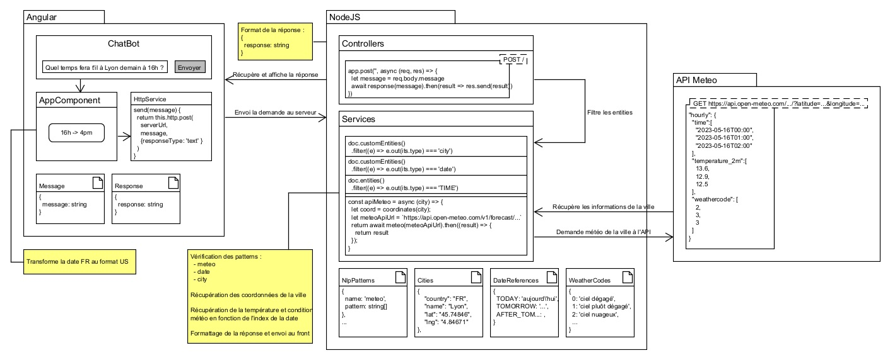
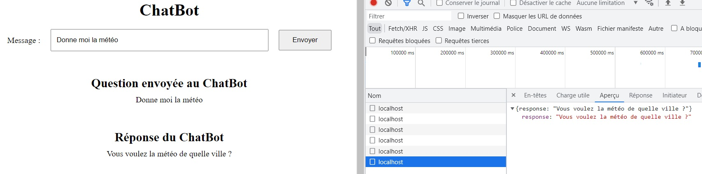
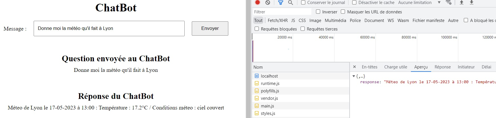
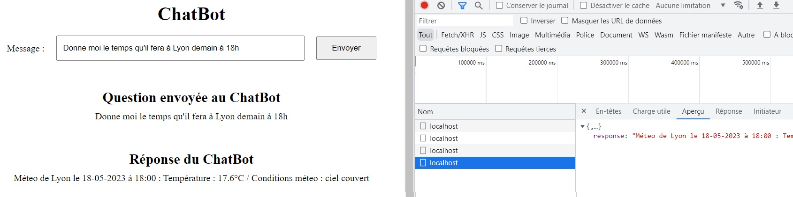

# Chatbot NodeJS

Angular version : 13.1.4

Node version : 18.16

## Client Angular

- Se placer dans le répertoire **chatbot/server**.
- Si première installation, lancer la commande `npm i` pour télécharger les dépendances. 
- Lancer le client avec la commande :
  ```
  ng s --port 4200
  ```

## Serveur NodeJS Express

- Se placer dans le répertoire **chatbot/client**.
- Si première installation, lancer la commande `npm i` pour télécharger les dépendances. 
- Lancer le serveur avec la commande :
  ```
  npm start
  ```

## Documentation fonctionnelle

### 1 - Généralités

Le ChatBot permet de recherche la météo d'une ville.

Mots clés pour recherche la météo :
- `météo` (avec ou sans accent).
- `climat`
- `temps`

Si aucun nom de ville affiché, le bot demande `Vous voulez la météo de quelle ville ?`

Si aucun mot clé pour rechercher la météo, le bot indique que `C'est une belle ville`.

Si ni ville, ni météo, le bot indique `Désolé, je ne comprends pas`.

### 2 - Recherche de la météo à l'heure H

Un demande du type `Donne moi le temps qu'il fait à Lyon ?` ou `Quelle est la météo à Lyon ?` permet d'afficher ma météo du jour à Lyon au moment précis ou l'utilisateur fait la demande.

### 3 - Recherche de la météo à une date différente

Certains mots clés sont détécté et permettent de recherche la météo à une date différente de la date du jour (ne fonctionne qu'à J+2 max):
- `aujourd'hui` : Recherche au jour J.
- `demain` : Recherche à J+1.
- `après demain` : Recherche à J+2.

Exemple : `Quel temps fera-t-il demain à Lyon ?`

### 4 - Recherche de la météo à une heure différente

Il est possible de taper plusieurs patterns d'heures pour rechercher la méteo à différents moments de la journée :
- `14h` ou `14 h`
- `14heure` ou `14 heure`
- `14heures` ou `14 heures`

Exemple : `Quel temps fera-t-il à Lyon à 21h ?`

**Il est bien sur possible de combiner les mots clés afin de recherche la météo d'un ville un jour précis, à une heure précise.**

## Documentation technique

### 1 - Routes
- Depuis Angular vers NodeJS : 
```
POST http://localhost:3000/
{
  "message": "Quel temps fera-t-il à Lyon demain ?"
}
```
```
RESPONSE 200
{
  "response": "Méteo de Lyon le 17-05-2023 à 09:00 : Température : 13.4°C..."
}
```
- Depuis NodeJS vers API : 
```
GET https://api.open-meteo.com/v1/forecast
parameters :
  - latitude=<latitude_de_la_ville>
  - longitude=<longitude_de_la_ville>
  - hourly=temperature_2m,weathercode (type d'infos recherchées)
```

### 2 - Schéma d'architecture 



## Proof Of Concept

### 1 - Demande météo sans nom de ville


### 2 - Météo du jour au moment de la demande


### 3 - Météo du lendemain à 18h
